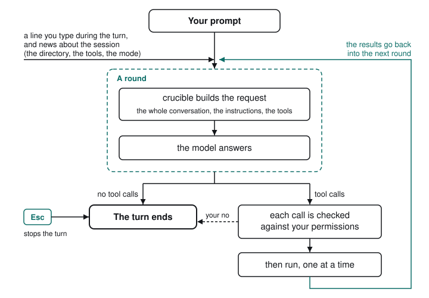

# How crucible works

<picture>
  <source media="(prefers-color-scheme: dark)" srcset="../assets/loop-dark.svg">
  
</picture>

You type a prompt and crucible answers it in a turn. A turn is a loop: crucible
sends the conversation to the model, the model answers, and if the answer asks
for tools crucible runs them and sends the conversation again with their
results in it. The loop goes round until the model answers without asking for
anything, and that answer is the one you read. One request and the answer to
it is what this page calls a round; the tools that answer asks for run before
the next one.

Before the first round on a route whose vendor says it may use what is sent to
train or improve its models, crucible asks you once, and nothing leaves until
you say yes: see [content use](../providers/content-use.md).

## One round

Every round sends the model the whole conversation so far, from your first
prompt to the latest tool result, together with the instructions and the tools
it may call. The instructions are fixed when crucible starts. The facts about
the session, such as where you are working and which mode is on, travel in the
conversation and are restated only when they change;
[What the model is told](../sessions/context.md) has the details.

The model answers with text, tool calls, or both, and the text streams onto
the screen as it arrives. When the answer holds no tool calls the turn is over.
When it holds tool calls, every call is shown on screen, and the answer is
written to the session with its calls before any of them runs, so a session
picked up later knows what was asked for even if the turn ended part way
through.

## Tool calls

Each call is decided before it runs. A `write` or `edit` of
[crucible's own configuration files](../permissions/permissions.md#the-files-the-file-tools-may-not-write)
in a directory the workspace reaches is refused before anything else is asked.
Otherwise your [rules](../permissions/rules.md) speak first, the
[mode](../permissions/modes.md) answers for calls no rule mentions, and when
what they settle on is "ask", the
[question](../permissions/permissions.md#the-question) appears. The two kinds
of no differ. Your no at the question ends the turn, and any call still
waiting is answered as not run. A `deny` rule refuses one call: the model is
told that policy does not allow it and that asking again will not change
that, and it carries on with the rest of the turn.

Calls run one at a time, in the order the model asked for them. A tool that
cannot do what was asked says so in a sentence, and that sentence is its
result;
[a failed tool is not a failed turn](../tools/tools.md#a-failed-tool-is-not-a-failed-turn).
Once every call of the round has a result, the results join the conversation
and the next round begins.

## How a turn ends

There is no separate step in which crucible checks the work, and no limit on
how many rounds a turn may take. The model decides when it is done: if it
wants to know whether its change builds, it runs the build or the tests as a
tool call like any other and reads the result. A turn ends when the model
answers without asking for a tool. It can also end sooner, for example when:

- You press <kbd>Esc</kbd>. The turn stops at its next step and nothing is
  killed, as
  [When an answer stops early](first-session.md#when-an-answer-stops-early)
  describes.
- You say no at a permission question.
- The answer stops early: it reached the model's output-token ceiling, the
  provider's filter cut it, or the provider paused it. The turn ends there,
  and the line under it says which.
  [When an answer stops early](first-session.md#when-an-answer-stops-early)
  explains what to do next.
- The turn produces more tokens than the `spendCeiling` in
  [configuration](../configuration/configuration.md#compaction). It is off
  unless you set it.
- A request fails and is not retried, or fails again on the retries described
  in
  [When a response goes away](../providers/providers.md#when-a-response-goes-away).
  A request asked at the vendor's [fast](../providers/fast.md) speed and refused
  for it is sent once more at standard speed first.
- The conversation no longer fits the model's window and crucible cannot make
  room, for example because the recap came back incomplete, because making
  room freed nothing, or because `compaction.when` is `never`; see
  [When the window fills](../sessions/sessions.md#when-the-window-fills).
- The tools' output within one turn grows past what crucible will hold for a
  turn.

## While a turn runs

A line you type while the turn runs is offered to it. The turn takes it at the
start of its next round, never in the middle of an answer or while a tool is
out, and the model adjusts course from there. A turn that was already
finishing leaves the line to be answered as a turn of its own;
[Getting started](first-session.md#run-it) says how the box behaves while
you type.

When something the model was told changes, such as a tool it found with
`tool_search` or a call you allowed for the rest of the session, the news
joins the conversation as a message at the start of the next round. The news
never rewrites an earlier message. A mode stepped with <kbd>Shift-Tab</kbd>
over a running turn is
[held for the turn after](../permissions/modes.md#stepping-it-while-you-type),
and the running turn keeps the mode it began under.

If the conversation fills the model's window in the middle of a turn, crucible
[makes room](../sessions/sessions.md#when-the-window-fills) between one round
and the next, and the turn carries on unless no room could be made. What is
replaced is what the model is sent; the session log keeps every message.

## One model, one conversation

A session is one conversation, and each turn is taken by one model. There are
no subagents: nothing a turn does starts another turn beside it, so every tool
call you see is that one model asking, and every result goes back to it.
